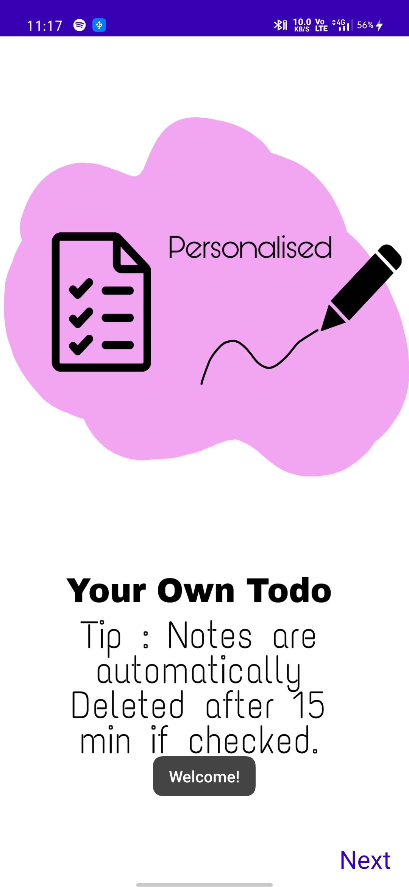
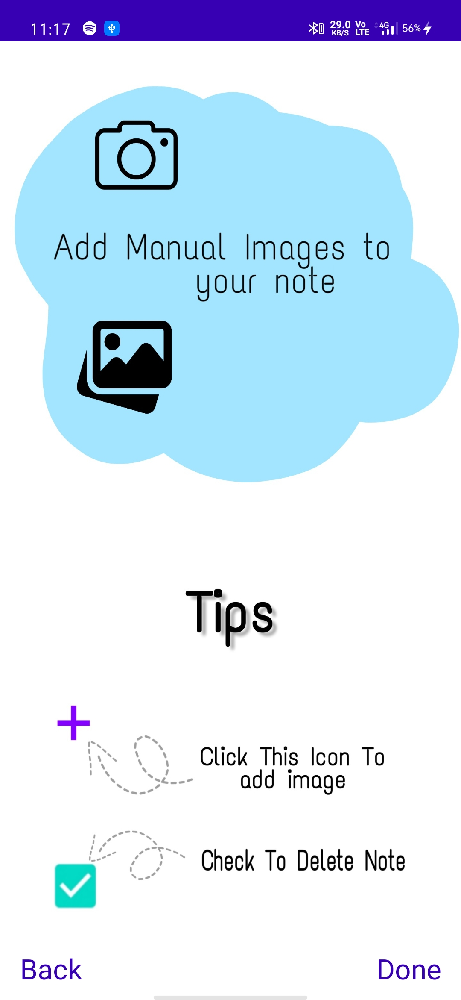
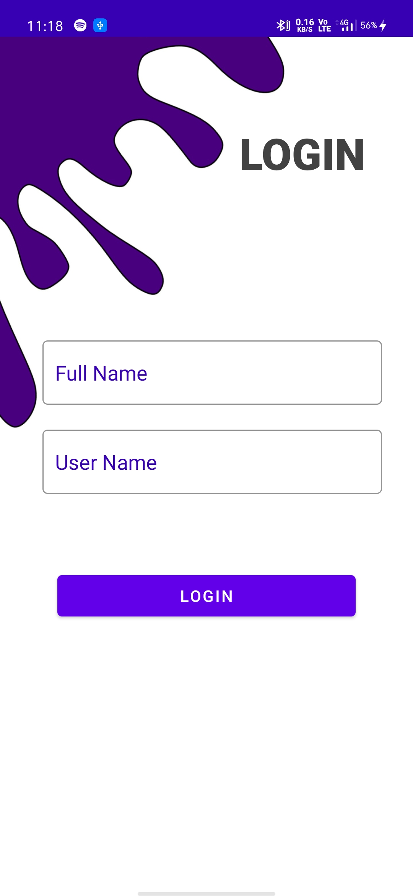
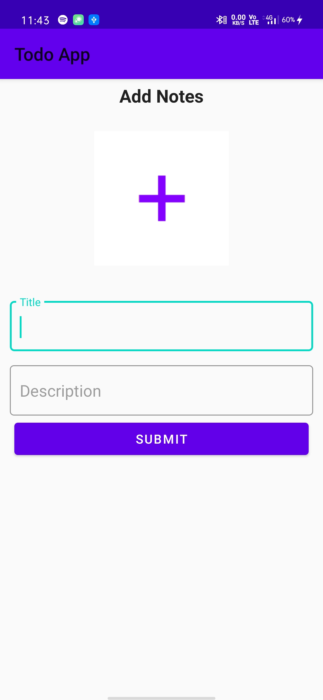
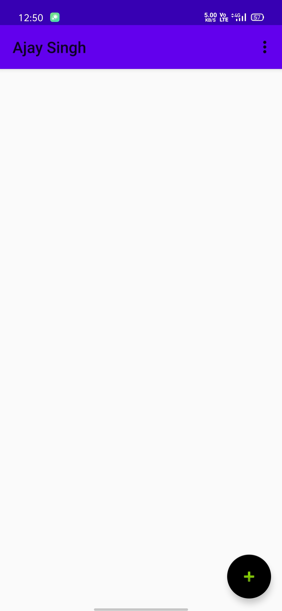
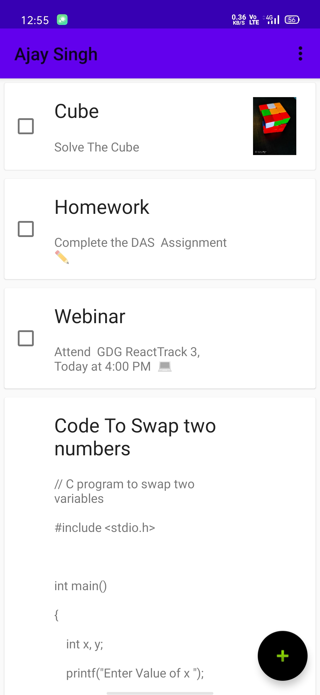

# TodoNotesApp 
##### `Track your day - Simple Todo Notes Application`

### Features
* Light weight and Simple UI
* Can add images with notes
* Auto Delete Tasks under 15 min if Checked

 ## Screen Shots
<table>
  <tr>
    <td> <kbd><kbd> </td>
    <td> <kbd><kbd> </td> 
    <td> <kbd><kbd> </td> 
  </tr>

  <tr>
    <td> <kbd><kbd> </td>
    <td> <kbd><kbd> </td> 
    <td> <kbd><kbd> </td>
  </tr>
 
 </table>

Download <a href="https://drive.google.com/open?id=1ELQ15izPU_Nuitg8PF8iwyYUbs_aIOYp">.apk</a>
